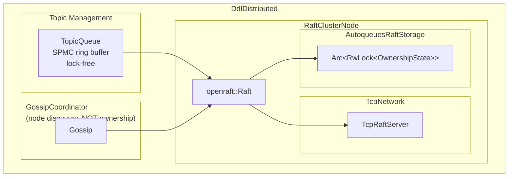

# DDL - Dumb Distributed Log

A minimal, high-performance distributed append-only log for HPC clusters.

## Features

- **Dumb by Design**: No clever features, just reliable log storage
- **High Performance**: Lock-free SPMC queues, O(1) operations
- **Strong Consistency**: Raft-based consensus for topic ownership
- **Fault Tolerant**: Automatic failover, leader election
- **Flexible**: Standalone or distributed modes

## Architecture



## Quick Start

```rust
use ddl::{DdlDistributed, DDL, DdlConfig};

#[tokio::main]
async fn main() -> Result<(), Box<dyn std::error::Error>> {
    // Standalone mode (single-node, testing)
    let config = DdlConfig::default();
    let ddl = DdlDistributed::new_standalone(config);
    
    // Subscribe to a topic
    let mut stream = ddl.subscribe("metrics.cpu").await?;
    
    // Push metrics
    ddl.push("metrics.cpu", vec![42]).await?;
    
    // Read from stream
    while let Some(entry) = stream.next().await {
        println!("Got metric: {:?}", entry);
        ddl.ack("metrics.cpu", entry.id).await?;
    }
    
    Ok(())
}
```

## Installation

Add to your `Cargo.toml`:

```toml
[dependencies]
ddl = { git = "https://github.com/nrj5k/DumbDistributedLog", branch = "main" }
```

## Multi-Node Cluster Deployment

DDL provides deployment scripts for running multi-node clusters across remote machines.

### Quick Start (Single Machine Testing)

For local testing without SSH, use the local cluster scripts:

```bash
# Terminal 1: Bootstrap node
./target/release/ddl-node --id 1 --port 7000 --bootstrap

# Terminal 2: Joining node
./target/release/ddl-node --id 2 --port 7001 --peers 1@localhost:7000

# Terminal 3: Another joining node  
./target/release/ddl-node --id 3 --port 7002 --peers 1@localhost:7000

# Or use the local cluster script
./scripts/start-cluster.sh 3 7000
./scripts/stop-cluster.sh
```

### Production Deployment (Multiple Machines)

For production clusters across multiple machines, use the remote deployment scripts:

#### Prerequisites

1. **SSH Access**: Passwordless SSH to all cluster nodes
   ```bash
   # Configure SSH for passwordless access
   ssh-copy-id user@ares-comp-13
   ssh-copy-id user@ares-comp-14
   ssh-copy-id user@ares-comp-15
   ssh-copy-id user@ares-comp-16
   ```

2. **Build Binary**: Build on all nodes or copy
   ```bash
   # On each node:
   cargo build --release --bin ddl-node
   
   # Or copy from one node:
   scp target/release/ddl-node user@ares-comp-13:~/ddl/target/release/
   ```

#### Deploy Cluster

```bash
# Deploy entire cluster in one command
./scripts/deploy-cluster-remote.sh --spec "ares-comp-[13-16]" --port-base 7000 --user neeraj

# This will:
# 1. Copy deployment script to all nodes
# 2. Start bootstrap node (ares-comp-13 by default)
# 3. Wait for bootstrap to initialize
# 4. Start joining nodes in parallel
# 5. Monitor startup progress
```

#### Manual Deployment (Per Node)

Or deploy manually on each node:

```bash
# On ares-comp-13 (bootstrap node):
./scripts/start-cluster-remote.sh --spec "ares-comp-[13-16]" --port-base 7000

# On ares-comp-14 (joining node):
./scripts/start-cluster-remote.sh --spec "ares-comp-[13-16]" --port-base 7000

# On ares-comp-15 (joining node):
./scripts/start-cluster-remote.sh --spec "ares-comp-[13-16]" --port-base 7000

# On ares-comp-16 (joining node):
./scripts/start-cluster-remote.sh --spec "ares-comp-[13-16]" --port-base 7000
```

#### Cluster Management

```bash
# Stop all nodes
./scripts/stop-cluster-remote.sh --spec "ares-comp-[13-16]" --user neeraj

# Check cluster status (on each node)
ssh neeraj@ares-comp-13 'ss -tlnp | grep ddl-node'
ssh neeraj@ares-comp-14 'ss -tlnp | grep ddl-node'

# View logs (on each node)
ssh neeraj@ares-comp-13 'tail -f /tmp/ddl-logs/ddl-node-ares-comp-13.log'
```

### Node Specification Format

The deployment scripts support flexible node specifications:

| Format | Example | Result |
|--------|---------|--------|
| Range | `ares-comp-[13-16]` | ares-comp-13, ares-comp-14, ares-comp-15, ares-comp-16 |
| Range | `node[1-5]` | node1, node2, node3, node4, node5 |
| List | `host1,host2,host3` | host1, host2, host3 |
| Single | `single-host` | single-host |

### Port Allocation

Default ports (configurable with `--port-base`):

| Node ID | Coordination Port |
|---------|-------------------|
| 1 | 7000 |
| 2 | 7001 |
| 3 | 7002 |
| 4 | 7003 |

Each node uses `--port-base + node_id - 1` for coordination traffic.

### Deployment Configuration

```bash
# Custom bootstrap ID (start from node 2)
./scripts/deploy-cluster-remote.sh --spec "ares-comp-[13-16]" --bootstrap-id 2

# Custom ports
./scripts/deploy-cluster-remote.sh --spec "ares-comp-[13-16]" --port-base 8000

# Custom data directory
./scripts/start-cluster-remote.sh --spec "node[1-5]" --data-dir /data/ddl

# Custom wait timeout (for slow networks)
./scripts/deploy-cluster-remote.sh --spec "node[1-10]" --wait-timeout 60
```

### Verification

```bash
# Check processes are running
for node in ares-comp-{13..16}; do
    echo "Checking $node..."
    ssh $node 'ps aux | grep ddl-node | grep -v grep'
done

# Check TCP connections
for node in ares-comp-{13..16}; do
    echo "Checking $node..."
    ssh $node 'ss -tn | grep 7000'
done

# Check log files
tail -f /tmp/ddl-logs/ddl-node-*.log
```

### Making Scripts Executable

Before using the deployment scripts, make them executable:

```bash
chmod +x scripts/start-cluster-remote.sh
chmod +x scripts/deploy-cluster-remote.sh
chmod +x scripts/stop-cluster-remote.sh
chmod +x scripts/status-cluster-remote.sh
chmod +x scripts/cluster-utils.sh
```

### Available Deployment Scripts

| Script | Purpose |
|--------|---------|
| `start-cluster-remote.sh` | Start a single node (runs on each node) |
| `deploy-cluster-remote.sh` | Deploy entire cluster via SSH |
| `stop-cluster-remote.sh` | Stop all nodes in cluster |
| `status-cluster-remote.sh` | Check cluster status |
| `start-cluster.sh` | Local testing (single machine) |
| `stop-cluster.sh` | Stop local cluster |
| `cluster-utils.sh` | Shared utility functions |

### Troubleshooting

**SSH Connection Issues**
```bash
# Test connectivity
ssh -o ConnectTimeout=5 user@ares-comp-13 'echo ok'

# If passwordless not configured:
ssh-copy-id user@ares-comp-13
```

**Port Conflicts**
```bash
# Check if ports are already in use
netstat -tlnp | grep 7000

# Kill existing processes
pkill -f ddl-node
```

**Binary Not Found**
```bash
# Build the binary
cargo build --release --bin ddl-node

# Or specify custom path
./scripts/start-cluster-remote.sh --binary /path/to/ddl-node
```

**Data Directory Issues**
```bash
# Clean up data directories
rm -rf ./ddl-data/node-*

# Or on remote nodes
ssh user@node 'rm -rf ~/ddl-data/node-*'
```

## Modes of Operation

### Standalone Mode

For single-node deployments or testing:

```rust
let ddl = DdlDistributed::new_standalone(DdlConfig::default());
```

### Distributed Mode with Raft

For multi-node clusters with strong consistency:

```rust
let config = DdlConfig {
    raft_enabled: true,
    is_bootstrap: true,  // Only first node
    owned_topics: vec!["metrics.cpu".to_string()],
    ..Default::default()
};

let ddl = DdlDistributed::new_distributed(config).await?;
```

## Configuration

```rust
let config = DdlConfig {
    // Node Configuration
    node_id: 1,
    
    // Buffer sizes
    buffer_size: 1_000_000,        // Ring buffer size
    subscription_buffer_size: 1000,   // Subscription queue size
    
    // Topic limits
    max_topics: 10_000,             // Maximum number of topics
    
    // Ownership (distributed mode)
    owned_topics: vec![],           // Topics this node owns
    raft_enabled: false,            // Enable Raft consensus
    is_bootstrap: false,            // Bootstrap node flag
    
    // Network (distributed mode)
    peers: HashMap::new(),          // Peer addresses
    gossip_bind_addr: "0.0.0.0:9090".to_string(),
    
    // Heartbeat/Timeout
    heartbeat_interval_secs: 5,
    owner_timeout_secs: 30,
};
```

## API Reference

### Push

```rust
// Push a message to a topic
let id = ddl.push("metrics.cpu", payload).await?;
```

### Subscribe

```rust
// Subscribe to a topic (returns async stream)
let mut stream = ddl.subscribe("metrics.cpu").await?;

while let Some(entry) = stream.next().await {
    // Process entry
    println!("Entry {}: {:?}", entry.id, entry.payload);
    
    // Acknowledge processing
    ddl.ack("metrics.cpu", entry.id).await?;
}
```

### Position

```rust
// Get current position (highest acknowledged entry)
let pos = ddl.position("metrics.cpu").await?;
```

### Ack

```rust
// Acknowledge processing of an entry
ddl.ack("metrics.cpu", entry_id).await?;
```

### Topic Ownership

```rust
// Check if this node owns a topic
if ddl.owns_topic("metrics.cpu").await {
    // This node owns the topic
}

// Claim topic ownership (distributed mode with Raft)
ddl.claim_topic("metrics.cpu").await?;

// Release topic ownership
ddl.release_topic("metrics.cpu").await?;
```

## Membership Events & SCORE Integration

DDL provides a comprehensive membership API for cluster lifecycle tracking, designed specifically for SCORE (HPC metrics aggregation system) integration. This API enables failover coordination, cluster health monitoring, and dynamic resource management.

### Overview

The membership API provides three core operations:

- **`subscribe_membership()`** - Subscribe to real-time cluster membership events
- **`membership()`** - Get current cluster state snapshot
- **`metrics()`** - Get DDL operational metrics for monitoring

> **Important**: These APIs are only available in Raft mode. In standalone or gossip-only mode, they return `None`. This is intentional design - membership tracking is only needed when you have multiple nodes coordinating via Raft consensus.

### Quick Start

```rust
use ddl::{DdlDistributed, DdlConfig, MembershipEventType};

// Initialize DDL in Raft mode
let config = DdlConfig {
    raft_enabled: true,
    is_bootstrap: true,
    owned_topics: vec!["metrics.cpu".to_string()],
    ..Default::default()
};
let ddl = DdlDistributed::new_distributed(config).await?;

// Subscribe to membership events
let mut events = ddl.subscribe_membership()
    .expect("Must be in Raft mode");

// Process events
while let Ok(event) = events.recv().await {
    match event.event_type {
        MembershipEventType::NodeFailed { node_id } => {
            eprintln!("Node {} failed - initiating failover", node_id);
            initiate_failover(node_id, &ddl).await;
        }
        MembershipEventType::NodeJoined { node_id, addr } => {
            println!("Node {} joined from {}", node_id, addr);
        }
        MembershipEventType::NodeRecovered { node_id } => {
            println!("Node {} recovered - rebalancing", node_id);
            rebalance_topics(node_id, &ddl).await;
        }
        MembershipEventType::NodeLeft { node_id } => {
            println!("Node {} left gracefully", node_id);
        }
    }
}
```

### Understanding the Option Return Type

All membership APIs return `Option<T>` instead of `Result<T, E>`:

```rust
// Why Option instead of Result?

// Some(...) → Raft mode, full membership tracking available
// None → Standalone mode, single node, no cluster needed

match ddl.subscribe_membership() {
    Some(mut events) => {
        // We have a cluster, process membership events
        while let Ok(event) = events.recv().await {
            handle_event(event);
        }
    }
    None => {
        // Standalone mode - no other nodes to track
        // This is a valid state, not an error
        println!("Running in standalone mode");
    }
}
```

**Design Rationale**:
- Standalone mode is a **valid, intentional deployment**, not a failure case
- Returning `None` eliminates the need for error handling in single-node scenarios
- Simplifies code for users who want to support both standalone and distributed modes
- No exceptions to handle - just check if membership is available

### Cluster Health Monitoring

Use `membership()` and `metrics()` together for comprehensive health monitoring:

```rust
// Periodic health check
fn print_cluster_health(ddl: &DdlDistributed) {
    // Get membership view
    let membership = match ddl.membership() {
        Some(m) => m,
        None => {
            println!("Standalone mode - no cluster health to report");
            return;
        }
    };

    println!("=== Cluster Health ===");
    println!("Local node: {}", membership.local_node_id);
    println!("Current leader: {:?}", membership.leader);
    println!("Cluster size: {} nodes", membership.nodes.len());

    // Get metrics
    let metrics = match ddl.metrics() {
        Some(m) => m,
        None => return,
    };

    println!("Active leases: {}", metrics.active_leases);
    println!("Raft commit index: {}", metrics.raft_commit_index);
    println!("Raft applied index: {}", metrics.raft_applied_index);
    println!("Pending writes: {}", metrics.pending_writes);
    println!("Pending reads: {}", metrics.pending_reads);
}
```

### SCORE Integration Pattern

SCORE (HPC metrics aggregation) uses DDL's membership API for:

1. **Failover Coordination** - Detect failed nodes and reassign topic ownership
2. **Dynamic Scaling** - Add/remove nodes based on cluster load
3. **Vertex Ownership** - TTL-based lease pattern for metric collection

#### Failover Coordination Example

```rust
async fn initiate_failover(failed_node_id: u64, ddl: &DdlDistributed) {
    // Get current membership to find topics owned by failed node
    let membership = match ddl.membership() {
        Some(m) => m,
        None => return,
    };

    // Find topics that were owned by the failed node
    let owned_topics: Vec<String> = membership.nodes
        .get(&failed_node_id)
        .and_then(|info| info.owned_topics.clone())
        .unwrap_or_default();

    // Reclaim each topic
    for topic in owned_topics {
        match ddl.claim_topic(&topic).await {
            Ok(()) => {
                println!("Claimed {} after node {} failure", topic, failed_node_id);
            }
            Err(e) => {
                eprintln!("Failed to claim {}: {}", topic, e);
            }
        }
    }
}
```

#### TTL-Based Vertex Ownership (Phase 2 Pattern)

SCORE's approach to vertex ownership using TTL-based leases:

```rust
use std::time::Duration;
use tokio::time::interval;

pub struct VertexLease {
    vertex: String,
    node_id: u64,
    ttl: Duration,
    ddl: Arc<DdlDistributed>,
    renewal_handle: JoinHandle<()>,
}

impl VertexLease {
    /// Claim a vertex with automatic TTL renewal
    pub async fn claim_with_ttl(
        ddl: &Arc<DdlDistributed>,
        vertex: &str,
        node_id: u64,
        ttl: Duration,
    ) -> Result<Self, DdlError> {
        // Claim the topic via Raft
        ddl.claim_topic(vertex).await?;

        let ddl = ddl.clone();
        let vertex = vertex.to_string();

        // Start renewal task
        let renewal_handle = tokio::spawn(async move {
            let mut interval = interval(ttl / 2);
            loop {
                interval.tick().await;
                // Renewal logic here
                if let Err(e) = ddl.claim_topic(&vertex).await {
                    eprintln!("Lease renewal failed for {}: {}", vertex, e);
                    break;
                }
            }
        });

        Ok(Self {
            vertex,
            node_id,
            ttl,
            ddl,
            renewal_handle,
        })
    }

    /// Release the vertex lease
    pub async fn release(self) {
        let _ = self.ddl.release_topic(&self.vertex).await;
        self.renewal_handle.abort();
    }
}

// Usage
let lease = VertexLease::claim_with_ttl(&ddl, "metrics.gpu.0", node_id, Duration::from_secs(30)).await?;
```

### Design Principles

The membership API follows DDL's KISS principles:

1. **Simple** - Just three methods, clear purpose
2. **Zero Overhead** - No overhead in standalone mode
3. **Explicit** - `Option` makes mode requirements clear
4. **Composable** - Works with standard Rust async patterns

### When to Use

| Deployment Mode | Use Membership API? |
|-----------------|---------------------|
| Single-node / testing | No (returns `None`) |
| Gossip-only mode | No (returns `None`) |
| Raft mode (production) | Yes (returns `Some`) |
| SCORE integration | Yes - required for failover |

## Architecture Decisions

### Why Dumb?

DDL is intentionally minimal:

1. **No clever routing** - Push to topic, subscribe to topic
2. **No complex APIs** - Push, Subscribe, Ack, Position
3. **No retries** - If push fails, caller retries
4. **No ordering guarantees** - Per-topic ordering only

### Topic Ownership via Raft

Topic ownership is managed by Raft consensus:

- **Strong consistency** - Only one node can own a topic at a time
- **Automatic failover** - If owner crashes, another node claims it
- **Lease-based** - Ownership has TTL, auto-renewed by owner

### Lock-Free Design

TopicQueue uses lock-free SPMC queues:

- **Single producer, multiple consumers**
- **Atomic positions** - No locks on read/write
- **Cache-friendly** - Ring buffer layout

## Performance

Benchmarks on AMD EPYC 7742:

| Operation | Latency | Throughput |
|-----------|---------|------------|
| Push (in-mem) | < 10µs | 100K+ ops/s |
| Subscribe receive | < 5µs | 200K+ ops/s |
| Push (WAL) | ~100µs | 10K+ ops/s |
| Topic claim (Raft) | ~5ms | 200 claims/s |

## HPC Integration

DDL is designed for HPC workloads:

- **Wildcards**: Subscribe to `metrics.*/` for hierarchical aggregation
- **Batching**: Push multiple entries efficiently
- **Backpressure**: Drop oldest when subscriber falls behind
- **Metrics**: Export metrics for monitoring

## Comparison

| Feature | DDL | Kafka | Redis Streams | NATS JetStream |
|----------|-----|-------|----------------|-----------------|
| Ordering | Per-topic | Per-partition | Per-stream | Per-subject |
| Persistence | Optional | Yes | Optional | Optional |
| Distributed | Raft | Raft/ZK | AOF/RDB | Raft |
| Complexity | Low | High | Medium | Medium |
| Performance | Excellent | Good | Good | Good |
| HPC Native | Yes | No | No | No |

## License

GNU General Public License v3.0 or later. See [LICENSE](LICENSE) file.

## Contributing

See [CONTRIBUTING.md](CONTRIBUTING.md) for guidelines.

## Credits

Developed for HPC metric aggregation systems.

Special thanks to the openraft and iroh-gossip projects.