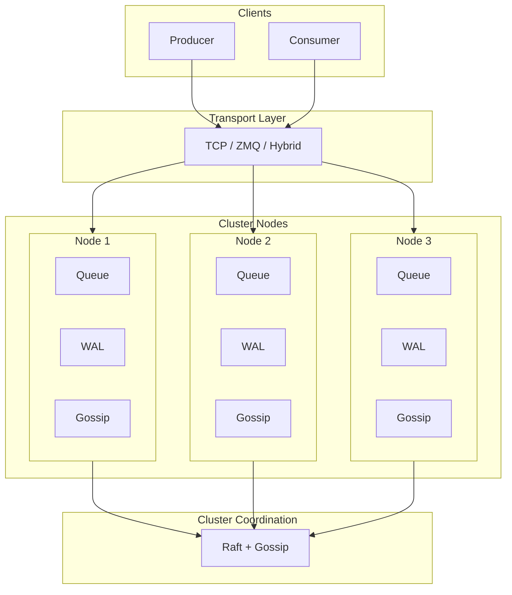
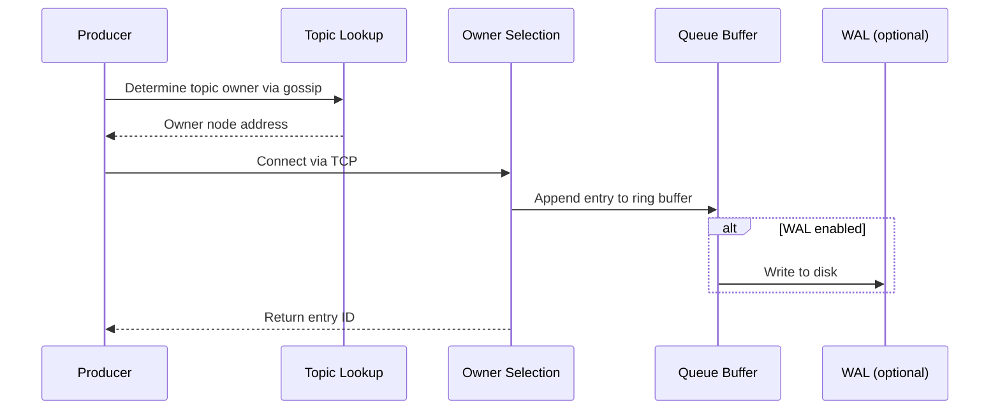
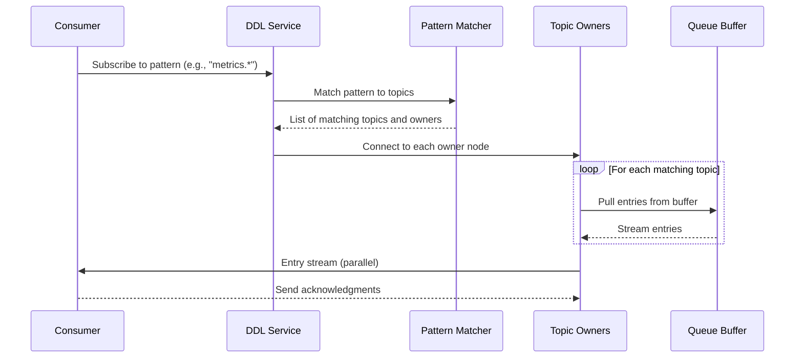
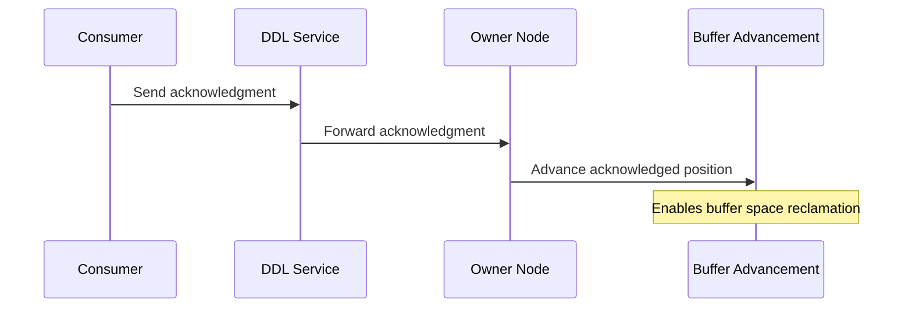
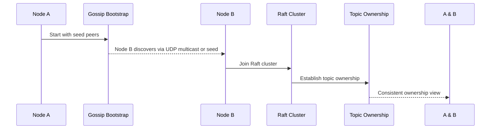
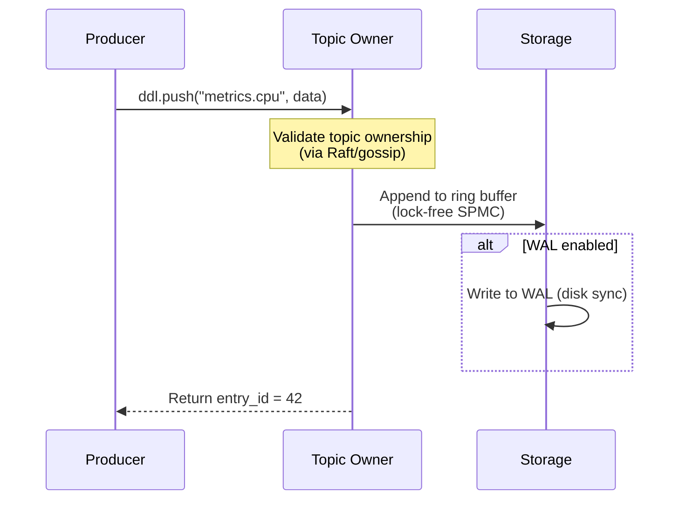
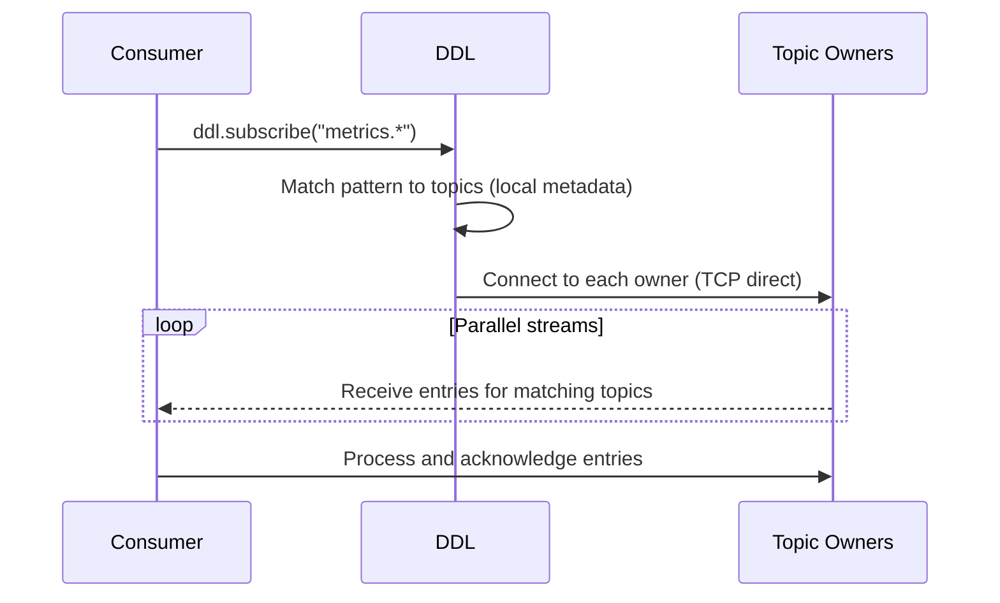
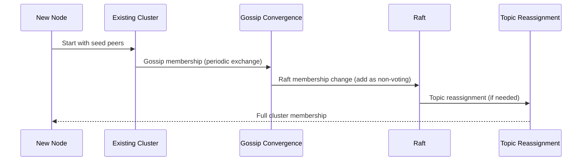

# DDL Architecture

**Complete technical architecture documentation for the Dumb Distributed Log system.**

## Table of Contents

1. [System Overview](#system-overview)
2. [Core Components](#core-components)
3. [Data Flow](#data-flow)
4. [Transport Layer](#transport-layer)
5. [Storage Layer](#storage-layer)
6. [Discovery Layer](#discovery-layer)
7. [Component Interactions](#component-interactions)
8. [Consistency Model](#consistency-model)
9. [Performance Characteristics](#performance-characteristics)

---

## System Overview

DDL (Dumb Distributed Log) is a distributed append-only log system designed for high-performance, large-scale deployments where Redis Streams falls short. The architecture prioritizes simplicity, reliability, and predictable performance over feature richness.

### Design Philosophy

DDL follows a **KISS (Keep It Simple, Stupid)** approach to distributed systems:

- **Simple Interfaces, Powerful Backends**: Clean trait-based APIs wrapping proven libraries (Raft, TCP, tokio)
- **Single Responsibility**: Each component does one thing well
- **Explicit Over Implicit**: No hidden magic, clear data flows
- **Honest Trade-offs**: Clear documentation of what DDL does and does not provide

### Key Design Decisions

1. **Raft for Shard Assignment Only**: Consensus is expensive, so DDL uses Raft only for deciding which node owns which topic. Actual data transfer uses direct TCP connections.

2. **Topic-Owner Model**: Each topic is owned by exactly one node at any time. Producers connect directly to the owner; no proxying or indirection.

3. **Pattern-Based Subscription**: Consumers subscribe to topic patterns (e.g., `metrics.*`) and receive matching entries from all owned topics.

4. **Optional Durability**: Users choose between in-memory (fast, no persistence) or WAL-backed (durable, slightly slower) storage per deployment.

### What DDL Is Not

- Not an expression engine (no math, filters, or aggregations)
- Not a metrics system (no health monitoring or dashboards)
- Not a complex monitoring platform (no alerts or dashboards)
- Not a general-purpose message queue (designed specifically for log-style workloads)

---

## Core Components

### Component Architecture



### DDL Trait (Core Interface)

The DDL trait defines the minimal interface all implementations must provide:

```rust
#[async_trait]
pub trait DDL: Send + Sync {
    /// Push data to a topic
    async fn push(&self, topic: &str, payload: Vec<u8>) -> Result<u64, DdlError>;
    
    /// Subscribe to topics (pattern matching)
    async fn subscribe(&self, pattern: &str) -> Result<EntryStream, DdlError>;
    
    /// Acknowledge entry processing
    async fn ack(&self, topic: &str, entry_id: u64) -> Result<(), DdlError>;
    
    /// Get current position for a topic
    async fn position(&self, topic: &str) -> Result<u64, DdlError>;
    
    /// Check if this node owns a topic
    fn owns_topic(&self, topic: &str) -> bool;
}
```

### Entry Structure

Each entry in the distributed log is a simple tuple:

```rust
pub struct Entry {
    /// Monotonically increasing ID within a topic
    pub id: u64,
    /// When the entry was created (nanoseconds since epoch)
    pub timestamp: u64,
    /// Which topic this entry belongs to
    pub topic: String,
    /// The actual data
    pub payload: Vec<u8>,
}
```

### Queue Component

The Queue component handles per-topic data management:

```rust
pub struct Queue {
    /// Ring buffer for entries (SPMC - Single Producer, Multiple Consumers)
    buffer: spmc::Queue<Entry>,
    /// Current position counter
    position: AtomicU64,
    /// Acknowledged position (for at-least-once delivery)
    acked_position: AtomicU64,
    /// Topic name
    name: String,
}
```

Key properties:
- Lock-free SPMC ring buffer for high performance
- Pre-allocated circular buffer to avoid reallocation
- Monotonically increasing entry IDs
- Acknowledgment support for at-least-once delivery

### Storage Layer

Two storage implementations are available:

1. **In-Memory Storage**: Zero-copy, fastest possible access, data lost on crash
2. **WAL-Backed Storage**: Write-ahead log for durability, slightly slower, survives crashes

### Network Layer

Multiple transport implementations:

1. **TCP Transport**: Reliable, connection-oriented, production-ready
2. **ZMQ Transport**: High-performance pub/sub, optional durability
3. **Hybrid Transport**: Combines TCP for control, ZMQ for data

---

## Data Flow

### Push Flow (Producer to Topic)



### Subscribe Flow (Consumer from Topics)



### Ack Flow (Reliability)



Purpose:
- Enables at-least-once delivery semantics
- Allows buffer space reclamation after acknowledgment
- Consumer groups can coordinate on shared offsets (via DDL trait extension)

---

## Transport Layer

### TCP Transport

The TCP transport provides reliable, connection-oriented messaging:

```rust
pub struct TcpTransport {
    /// Listen address
    bind_addr: SocketAddr,
    /// Connection pool
    connections: DashMap<String, TcpStream>,
    /// Send channel
    send_tx: Sender<(String, Message)>,
}
```

Characteristics:
- Reliable delivery (TCP guarantees)
- Connection-oriented (handshake overhead)
- Flow control and congestion handling
- Mature, well-understood behavior

Best for:
- Production deployments
- Cross-region communication
- When reliability is critical

### ZMQ Transport

The ZMQ transport provides high-performance pub/sub messaging:

```rust
pub struct ZmqTransport {
    /// ZMQ context
    context: zmq::Context,
    /// Publish socket
    publisher: zmq::Socket,
    /// Subscription router
    subscriber_router: zmq::Socket,
}
```

Characteristics:
- High throughput (optimized for pub/sub)
- Multiple messaging patterns (PUB/SUB, REQ/REP, PUSH/PULL)
- No client connection management
- Optional durability via message queuing

Best for:
- Single-datacenter deployments
- Maximum throughput requirements
- When ZMQ expertise is available

### Transport Comparison

| Aspect | TCP | ZMQ |
|--------|-----|-----|
| Reliability | High (TCP guarantees) | Medium (depends on configuration) |
| Latency | ~100μs | ~50μs |
| Throughput | High | Very High |
| Complexity | Low | Medium |
| Durability | None (by default) | Optional (message queues) |
| Cross-region | Excellent | Limited |
| Production Ready | Yes | Yes |

### Transport Selection Guidelines

**Choose TCP when:**
- Operating across multiple regions
- Reliability is more important than maximum throughput
- Standard networking tools should work with the system
- Minimal operational complexity is desired

**Choose ZMQ when:**
- All nodes are in the same datacenter
- Maximum throughput is required
- ZMQ expertise is available in the team
- Complex messaging patterns are needed

**Choose Hybrid when:**
- Control plane needs TCP reliability
- Data plane needs ZMQ performance
- Mixed workload characteristics exist

---

## Storage Layer

### In-Memory Storage

The in-memory storage provides the fastest possible access:

```rust
pub struct InMemoryStorage {
    /// Topics map: topic_name -> Queue
    topics: DashMap<String, Queue>,
    /// Topic metadata
    metadata: DashMap<String, TopicMetadata>,
}
```

Characteristics:
- Zero-copy where possible
- Pre-allocated ring buffers
- Single instance per topic (no duplication)
- Lock-free SPMC queue for concurrent access

Performance:
- Push latency: <10μs
- Subscribe receive: <5μs
- Memory usage: O(topics * buffer_size)

Trade-offs:
- Data lost on crash
- Memory pressure with many topics
- No replay capability

### WAL-Backed Storage

The WAL (Write-Ahead Log) storage provides durability:

```rust
pub struct WalStorage {
    /// WAL manager for each topic
    wal_manager: WalManager,
    /// In-memory cache (hot data)
    cache: DashMap<String, Queue>,
    /// Data directory
    data_dir: PathBuf,
}
```

Characteristics:
- Append-only log files (using waly library)
- Synchronous writes for durability
- Crash recovery from last checkpoint
- Compaction for long-running deployments

Performance:
- Push latency: ~100μs (includes disk sync)
- Subscribe receive: <5μs (from cache)
- Recovery time: O(uncommitted_entries)

Trade-offs:
- Slower than pure in-memory
- Disk I/O overhead
- Storage space requirements

### Storage Selection Guidelines

**Choose In-Memory when:**
- Data is recomputable or non-critical
- Maximum latency is required
- Crash recovery is handled externally
- Memory is sufficient for workload

**Choose WAL when:**
- Data must survive crashes
- Replay capability is needed
- Latency requirements are moderate
- Storage space is available

**Hybrid approach:**
- Hot data in memory, cold data in WAL
- Configurable flush policies
- Tiered storage for large deployments

---

## Discovery Layer

### Gossip-Based Discovery

DDL uses gossip protocol for node discovery and topic ownership:

```rust
pub struct GossipProtocol {
    /// Node ID
    node_id: u64,
    /// Gossip bind address
    bind_addr: String,
    /// Bootstrap peers
    bootstrap_peers: Vec<String>,
    /// Known peers (discovered)
    peers: DashMap<u64, PeerInfo>,
    /// Topic ownership map
    topic_ownership: Arc<RwLock<TopicOwnershipMap>>,
}
```

How gossip works:
1. Nodes periodically exchange state with random peers
2. Each node maintains a view of cluster membership
3. Topic ownership information is propagated via gossip
4. Nodes converge on consistent view eventually

Characteristics:
- Eventually consistent
- No single point of failure
- Scales to large clusters
- Self-organizing

### Raft-Based Coordination

Raft provides strong consistency for cluster coordination:

```rust
pub struct RaftCluster {
    /// Raft storage
    storage: Arc<RaftStorage>,
    /// Current leadership state
    state: Arc<RwLock<RaftState>>,
    /// Applied index
    applied_index: AtomicU64,
}
```

What Raft handles:
- Topic ownership assignments
- Node membership changes
- Cluster leadership election
- Shard migration coordination

What Raft does NOT handle:
- Data transfer (direct TCP between nodes)
- Consumer coordination (stateless consumers)
- Rate limiting (per-topic configuration)

### Discovery Flow



### Push Interaction Sequence



### Subscribe Interaction Sequence



### Cluster Membership Change



---

## Consistency Model

### Guarantees Provided

**Per-Topic Ordering:**
- All entries for a single topic are delivered in the order they were pushed
- Entry IDs are monotonically increasing within a topic

**At-Least-Once Delivery (with acknowledgments):**
- Entries are redelivered if acknowledgment is not received
- Consumer must handle duplicate entries

**Topic Ownership:**
- Each topic is owned by exactly one node at any time
- Ownership changes are atomic (via Raft)

**Eventual Consistency for Discovery:**
- Gossip propagation takes time
- Temporary inconsistencies possible during membership changes

### Guarantees NOT Provided

- **No Global Ordering**: Entries across different topics may be delivered out of order
- **No Transaction Support**: Multi-topic operations are not atomic
- **No Message Replay (by default)**: Once acknowledged, entries are gone
- **No Automatic Failover**: Topics owned by failed nodes become unavailable

### Consistency vs. Performance Trade-offs

| Guarantee | Implementation | Performance Impact |
|-----------|----------------|-------------------|
| Ordering | Per-topic sequences | None (local only) |
| At-least-once | Acknowledgment tracking | Minimal (per-entry metadata) |
| Topic ownership | Raft consensus | High for ownership changes |
| Discovery | Gossip | Low (background process) |

---

## Performance Characteristics

### Latency Targets

| Operation | In-Memory | WAL-Backed |
|-----------|-----------|------------|
| Push | <10μs | ~100μs |
| Subscribe receive | <5μs | <5μs |
| Gossip propagation | <100ms | <100ms |
| Shard migration | ~50ms | ~50ms |
| Recovery (per topic) | N/A | O(uncommitted) |

### Throughput Targets

| Configuration | Messages/Second | Notes |
|---------------|-----------------|-------|
| Single node (in-memory) | 100,000+ | CPU-bound |
| Single node (WAL) | 10,000+ | Disk I/O bound |
| Cluster (3 nodes) | 300,000+ | Network-bound |
| Cluster (10 nodes) | 1,000,000+ | Depends on topic distribution |

### Scalability Characteristics

**Vertical Scaling:**
- Each node can handle many topics
- Memory scales with topics * buffer_size
- CPU scales with push/subscribe rate

**Horizontal Scaling:**
- Adding nodes increases total capacity
- Topic distribution determines load balancing
- Gossip overhead scales with O(n²) worst case

### Performance Tuning

**For Lower Latency:**
- Increase ring buffer sizes to avoid blocking
- Use in-memory storage for non-critical data
- Reduce network hops (local producer/consumer)

**For Higher Throughput:**
- Batch multiple entries per push
- Use ZMQ transport for data plane
- Increase partition count (topics)

**For Better Reliability:**
- Enable WAL with sync
- Use TCP transport
- Increase acknowledgment timeout

---

## Summary

DDL's architecture provides a solid foundation for distributed logging with clear trade-offs between performance, reliability, and complexity. The key design decisions are:

1. **Simple trait-based API** for easy integration
2. **Topic-owner model** for direct communication
3. **Multiple transport options** (TCP, ZMQ, Hybrid)
4. **Multiple storage options** (in-memory, WAL)
5. **Gossip + Raft** for discovery and coordination
6. **Honest documentation** of limitations and trade-offs

This architecture enables DDL to handle the ORNL Frontier use case (10,000+ compute nodes, each producing to its own topic) while remaining simple enough for single-node deployments.